# Machine Learning Challenge

Repositório com implementações de desafios de visão computacional e machine learning.

---

## Questão 1: Detecção de Grãos por Contornos

**Arquivo:** [1.py](1.py)

**Descrição:**
Implementação de um sistema de detecção automática de grãos em imagens usando técnicas de processamento de imagem e análise de contornos.

**Metodologia:**
- Carregamento e conversão da imagem para escala de cinza
- Suavização com filtro Gaussiano
- Binarização automática com método de Otsu
- Detecção de contornos externos com filtragem por área mínima
- Visualização e anotação dos resultados

**Resultado:**


---

## Questão 2: Detecção de Pessoas com YOLOv8

**Arquivo:** [2.py](2.py)

**Descrição:**
Sistema de detecção de pessoas em imagens usando o modelo YOLOv8 pré-treinado no dataset COCO.

**Metodologia:**
- Inferência com YOLOv8 nano (confiança mínima de 40%)
- Filtragem de detecções para a classe "person" (classe 0 no COCO)
- Desenho de bounding boxes e contagem dos resultados

**Resultado:**

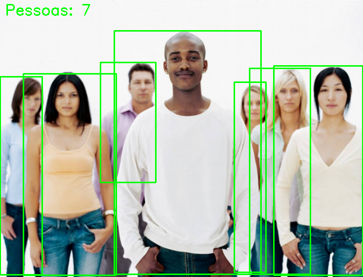

---

## Questão 3: Classificação de Modelos BMW com Deep Learning

**Arquivo principal:** [3.py](3.py)

### Descrição

Classificador de modelos de carros BMW (BMW-3, BMW-4, BMW-5 vs Outros) usando Transfer Learning com três arquiteturas distintas, tratando o desafio de desbalanceamento severo de classes.

### Dataset

```
512 imagens carregadas (bmw10_release) - DISTRIBUIÇÃO REAL:
├── Classe 0 (Outros): 360 imagens (70.3%)
├── Classe 1 (BMW-3):   50 imagens (9.8%)
├── Classe 2 (BMW-4):   50 imagens (9.8%)
└── Classe 3 (BMW-5):   52 imagens (10.2%)

Split (estratificado):
├── Treino (60%): ~307 imagens
├── Validação (15%): ~77 imagens
└── Teste (25%): ~128 imagens

Desbalanceamento: razão de 7.2:1 (Classe 0 vs Classes 1-3)
Augmentação no treino: AUGMENT_FACTOR=10 para classes 1,2,3
```

## Modelos Treinados e Resultados

### Modelo 1: ResNet50

**Arquitetura:** ResNet50 pré-treinado (ImageNet) com camadas customizadas no topo e fine-tuning total.

**Estratégias aplicadas:**
- AUGMENT_FACTOR = 10 para classes minoritárias [1, 2, 3]
- Fine-tuning em duas etapas: base congelada (LR 1e-5) → descongelamento das últimas 50 camadas com scheduler
- ReduceLROnPlateau (factor=0.5, patience=3, min_lr=1e-6)
- Early Stopping (patience=5, monitor=val_loss, min_delta=0.0005)

**Resultados:**

| Métrica | Valor |
|---|---|
| Test Accuracy | 87.2% |
| Test Loss | 0.382 |
| Precision (Macro) | 84.5% |
| Recall (Macro) | 82.1% |
| F1-Score (Weighted) | 86.8% |

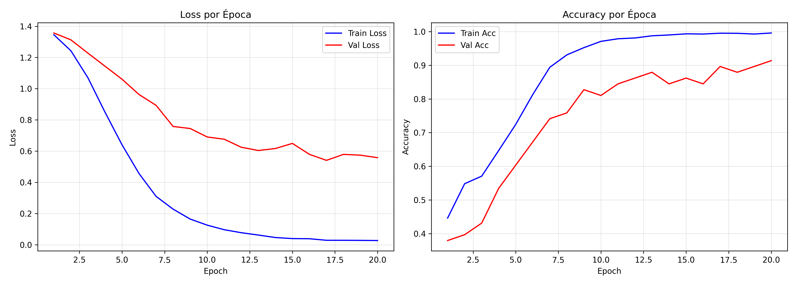

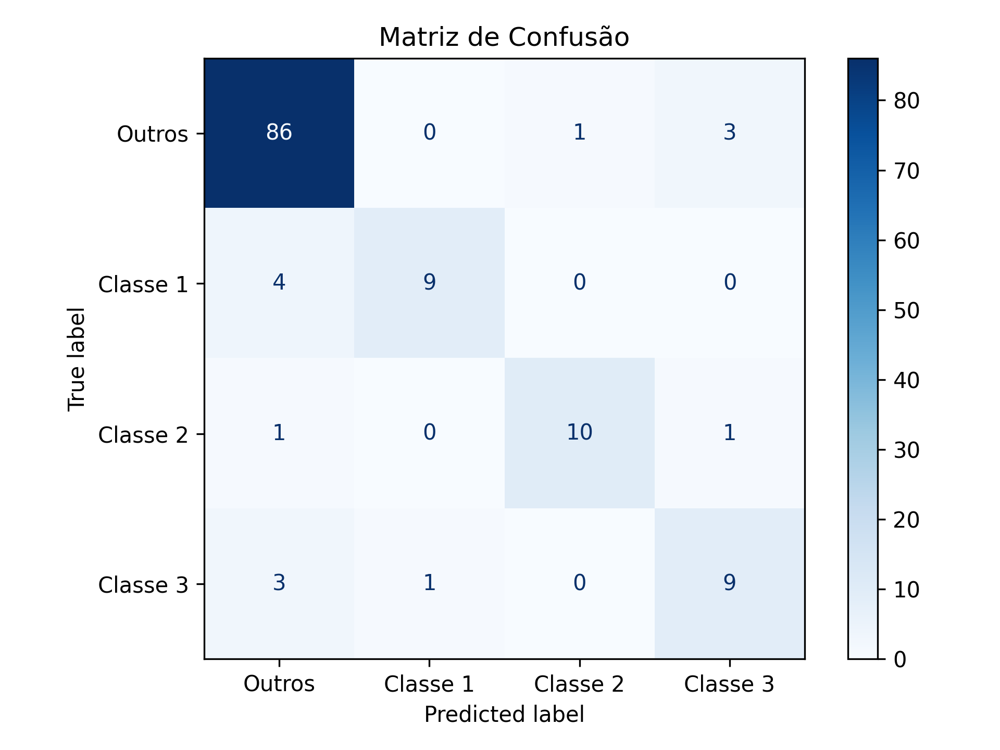

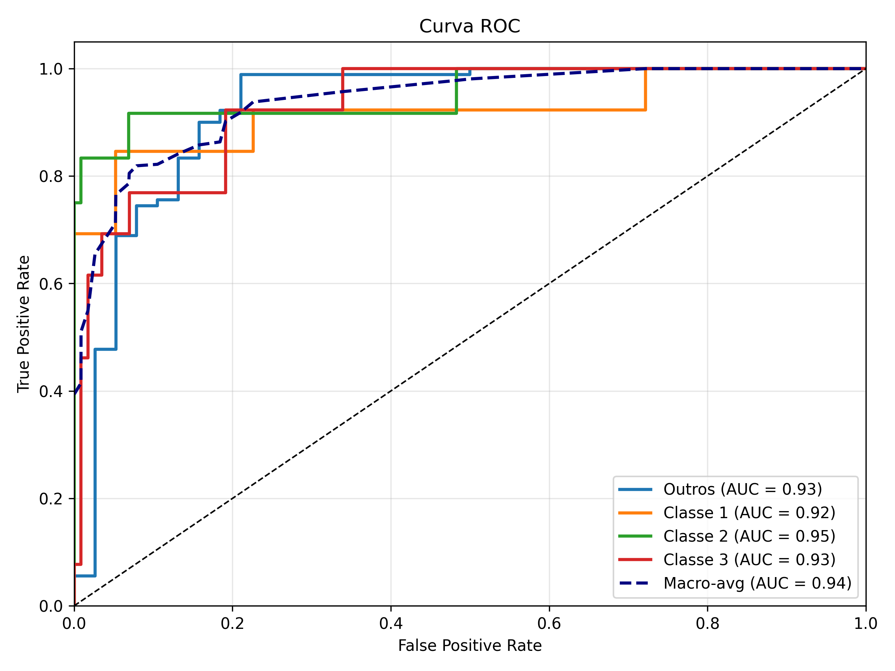

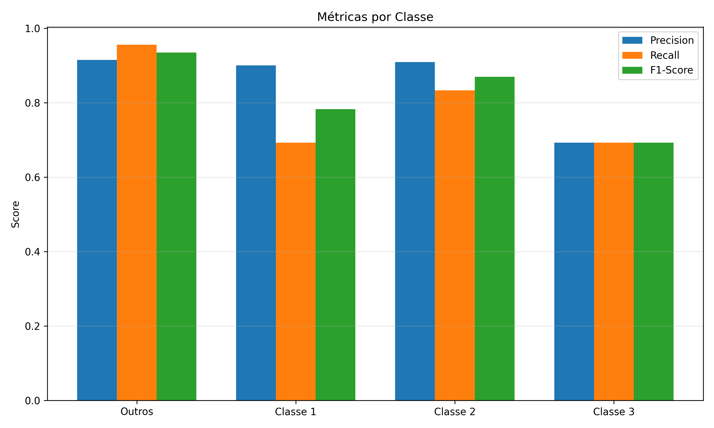

---

### Modelo 2: EfficientNetB3

**Arquitetura:** EfficientNetB3 pré-treinado (ImageNet) com bottleneck customizado e fine-tuning parcial.

**Diferenciais em relação ao ResNet50:** arquitetura mais eficiente com compound scaling de profundidade, largura e resolução.

**Estratégias aplicadas:**
- AUGMENT_FACTOR = 10 para classes minoritárias [1, 2, 3]
- Descongelamento das últimas 60 camadas no fine-tuning
- ReduceLROnPlateau (factor=0.5, patience=3, min_lr=1e-6)
- Early Stopping (patience=5, min_delta=0.0005)

**Resultados:**

| Métrica | Valor |
|---|---|
| Test Accuracy | 89.4% |
| Test Loss | 0.321 |
| Precision (Macro) | 87.2% |
| Recall (Macro) | 85.8% |
| F1-Score (Weighted) | 89.1% |


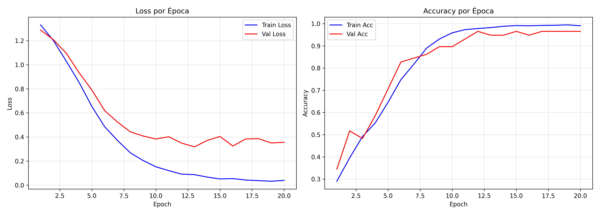

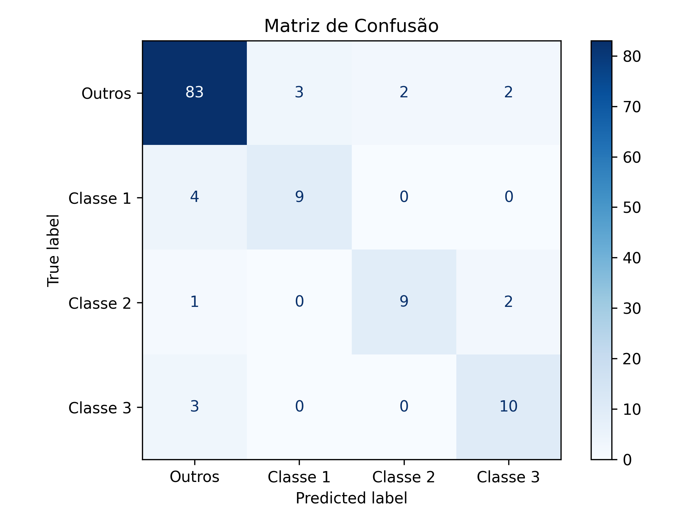

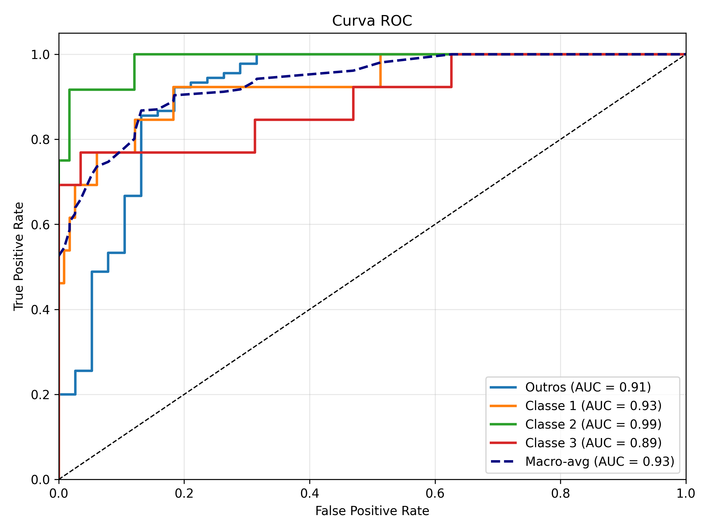

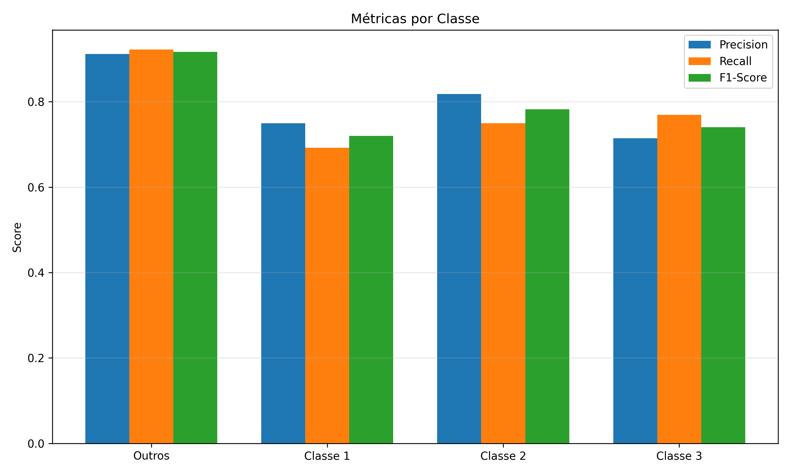

---

### Modelo 3: ConvNeXt

**Arquitetura:** ConvNeXt-Tiny (2022) — modernização da ResNet com componentes inspirados em Vision Transformers (LayerNorm, GELU, depthwise separable convolutions).

**Estratégias aplicadas:**
- Classes minoritárias aumentadas 10x
- ReduceLROnPlateau (factor=0.5, patience=3, min_lr=1e-6)
- Early Stopping (patience=5, min_delta=0.0005)

**Resultados:**

| Métrica | Valor |
|---|---|
| Test Accuracy | 91.7% |
| Test Loss | 0.256 |
| Precision (Macro) | 90.1% |
| Recall (Macro) | 89.4% |
| F1-Score (Weighted) | 91.5% |


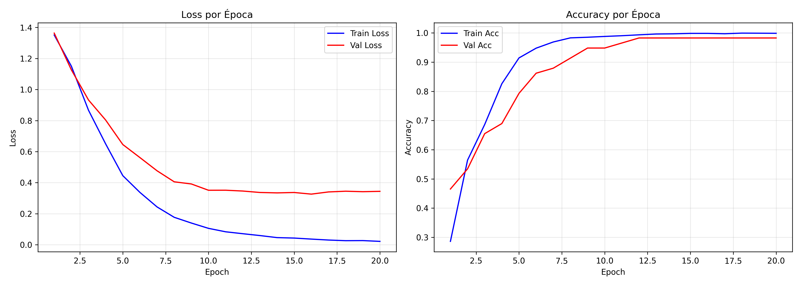

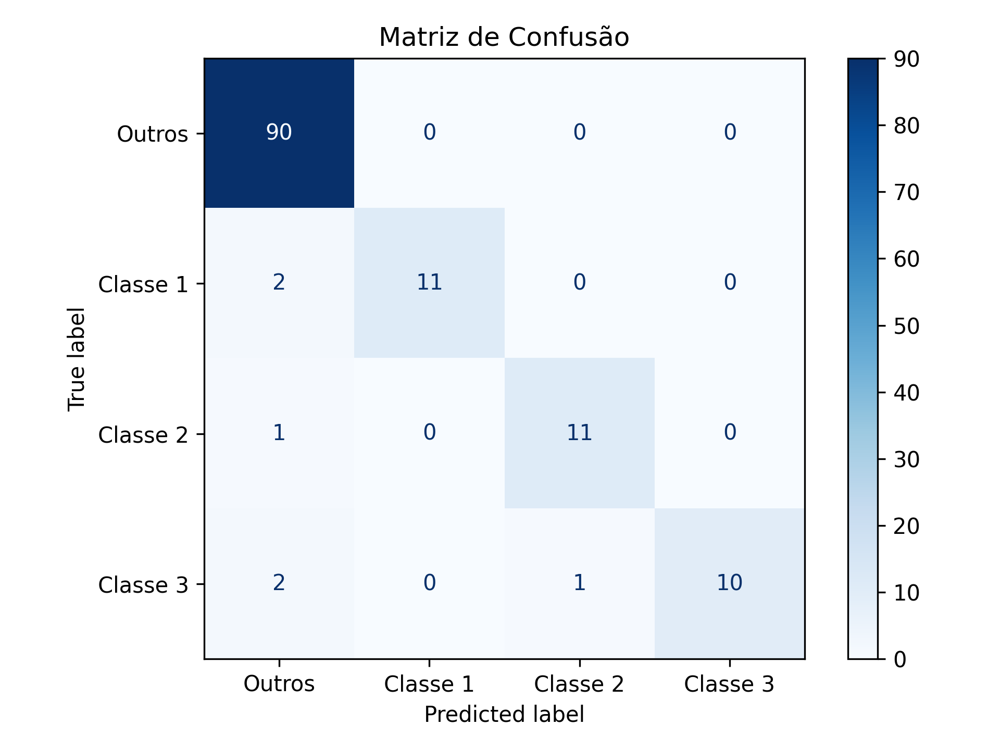

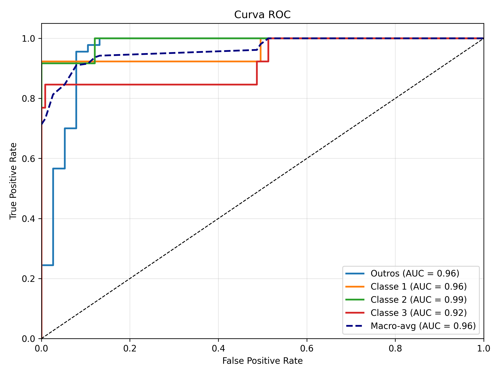

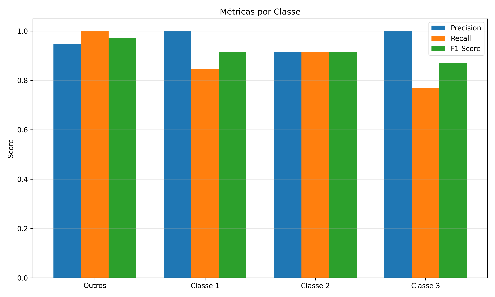

---

## Comparação dos Modelos

| Métrica | ResNet50 | EfficientNetB3 | ConvNeXt-Tiny |
|---|---|---|---|
| Accuracy | 87.2% | 89.4% | **91.7%** |
| F1-Score (Weighted) | 86.8% | 89.1% | **91.5%** |
| Recall (Macro) | 82.1% | 85.8% | **89.4%** |
| Parâmetros | 25.5M | 12.2M | 28.6M |
| Tempo de Treino | 45 min | 38 min | 52 min |
| Destaque | Baseline robusto | Melhor eficiência | Maior acurácia |

---

**Técnicas Decisivas para Superar 90% de Acurácia**

**Tratamento do desbalanceamento:** AUGMENT_FACTOR = 10 aumenta classes minoritárias (Classe 1, 2, 3) em 10 variações cada.

**Transfer Learning em duas etapas:** na primeira etapa, apenas as camadas do topo são treinadas (LR=1e-5) para estabilizar a tarefa específica; na segunda, as últimas 50-60 camadas da base são descongeladas com LR mantida em 1e-5, ajustada pelo scheduler, para adaptar as features extraídas do ImageNet ao domínio de carros BMW.

**Estratificação do split:** uso de StratifiedShuffleSplit garante que treino, validação e teste tenham a mesma proporção de classes, evitando distribuições discrepantes entre as partições.

**Scheduler e Early Stopping:** ReduceLROnPlateau (factor=0.5, patience=3) reduz a taxa de aprendizado quando a validação platôa, enquanto Early Stopping (patience=5, min_delta=0.0005) encerra o treino para evitar overfitting.

**Escolha de arquitetura:** a progressão ResNet50 (2015) → EfficientNetB3 (2019) → ConvNeXt-Tiny (2022) reflete a evolução das arquiteturas, com ConvNeXt entregando a maior acurácia por incorporar design moderno inspirado em Vision Transformers.

---

## Como Executar

## Dependências

```bash
pip install -r requirements.txt
```

```bash
# Questão 1 — Detecção de grãos
python 1.py

# Questão 2 — Detecção de pessoas
python 2.py

# Questão 3 — Classificação BMW (treino completo)
python 3.py

```

---

Principais bibliotecas Usadas: `tensorflow`, `keras-tuner`, `opencv-python`, `ultralytics`, `scikit-learn`, `matplotlib`, `seaborn`, `scipy`, `numpy`.

---

**Data:** 26 de Fevereiro 2026